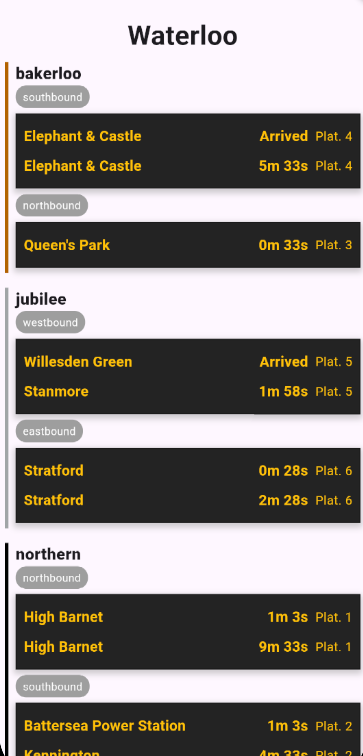

# TFL Helper
_Name still TBD_

A simple app that auto detects the London Underground Station you'r at at displays the next two tube arrivals for each underground line serving that station, in both directions (eg. Northbound & Southbound), the tubes TTS (time to station), and the platform it will arive at. 

It also displays the any network distruptions for the London Ungerground.



The App hooks into the devices location stream so will update every 10(ish) meters.

## The Techy Side

This data comes from [TFL's Open API](https://api-portal.tfl.gov.uk/apis).

The app doesn't directly communicate with TFL, instead calling a backend server that is responsible for gathering and agitating the data. This limits the number of calls the app has to make, reducing bandwith usage..


The server makes multiple API calls, theses currently are:

```bash
  #Finds Closest Underground Station
  https://api.tfl.gov.uk/StopPoint/?lat={latitude}&lon={longitude}&stopTypes=NaptanMetroStation&radius=400

  #Gets all arivals
  https://api.tfl.gov.uk/StopPoint/{naptan_id}/arrivals

  #Gets the line status for the lines
  https://api.tfl.gov.uk/Line/{line_id}/Status
```

Theses are all filtered and agrigated together, and then built to create a easy to use JSON output for the app to display.

The APP then can call:

```bash
  https://tfl.leon-skinner.dev/api/v1/stations/live_departures_predictions?lat={lat}&lon={lon}
```
_For more details check the [backend repo](https://github.com/TidalCub/Information-Engineering-Project-Backend)_

And recieves:

```JSON
  "station": {
        "naptan_id": "940GZZLUWLO",
        "name": "Waterloo",
        "latitude": 51.503299,
        "longitude": -0.11478,
        "lines": [
            {
                "id": "bakerloo",
                "line_name": "Bakerloo",
                "uri": "/Line/bakerloo"
            },
            ........
        ]
    },
    "arrivals": {
        "bakerloo": [
            {
                "destination_name": "Harrow & Wealdstone",
                "destination_naptan_id": "940GZZLUHAW",
                "direction": "northbound",
                "platform": "3",
                "time_to_station": 97,
                "expected_arrival": "2024-10-31T15:24:12Z"
            },
            .....]}
```